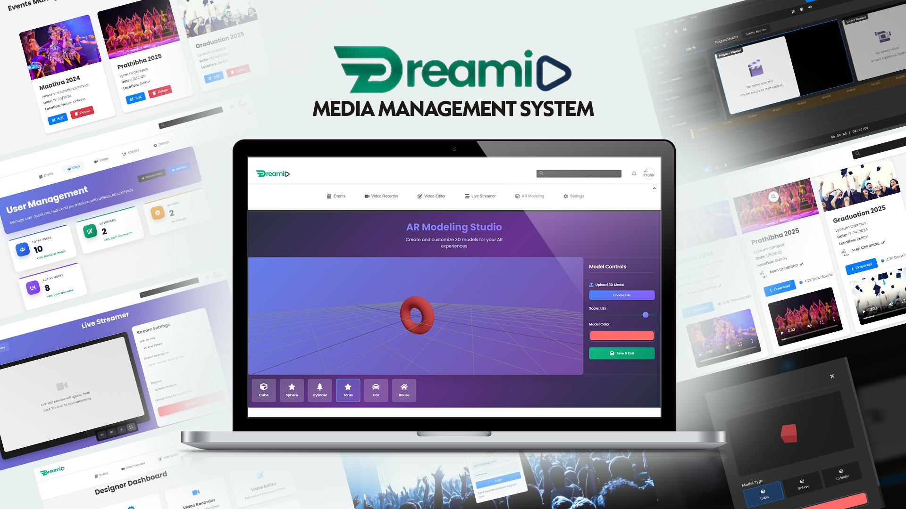
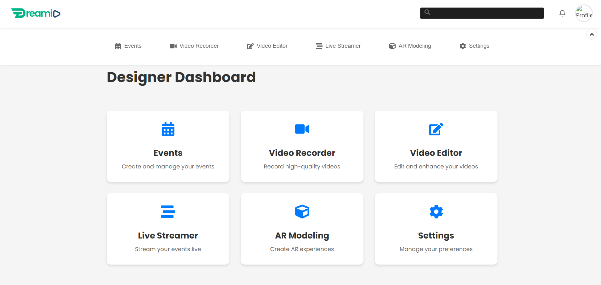
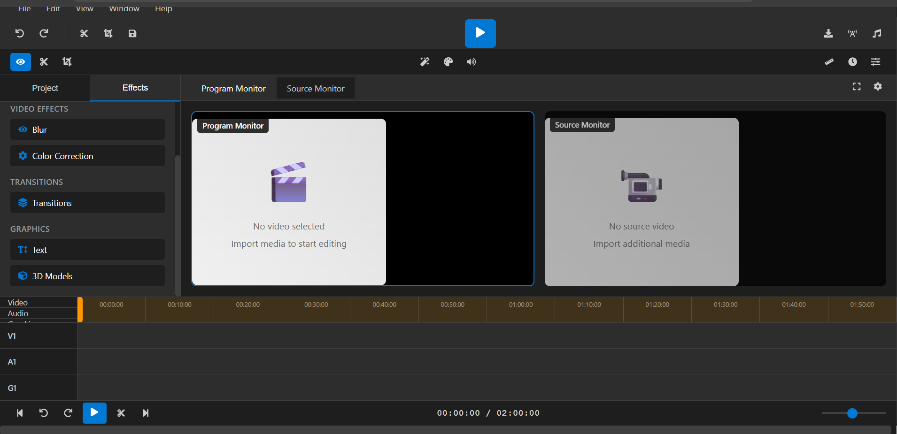
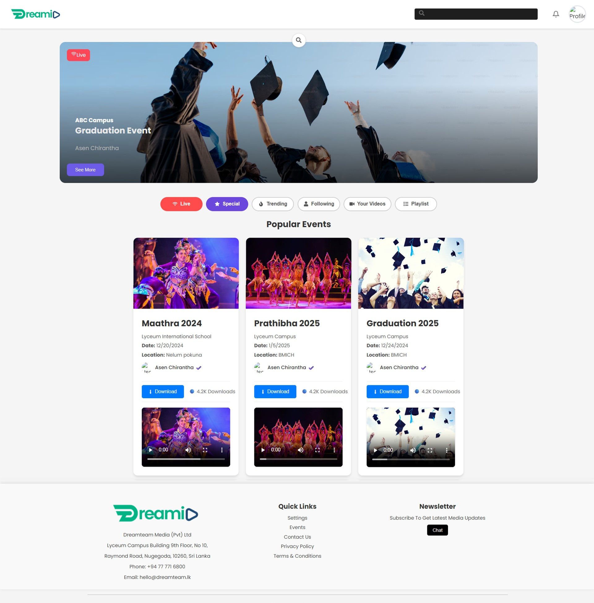
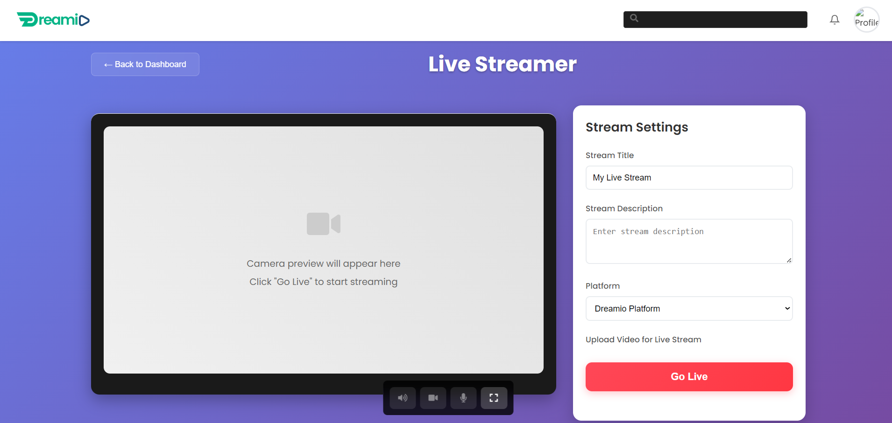
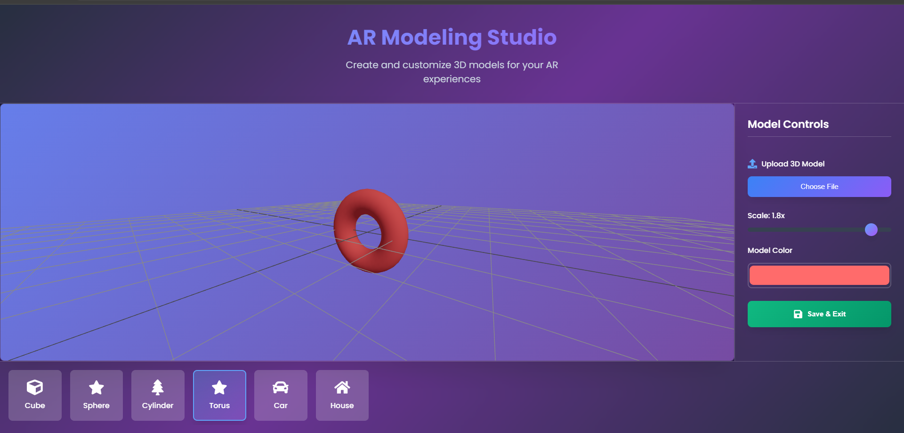

# 🎬 Dreamio - Media Management System

A comprehensive media management platform built with React.js and Node.js, designed for educational institutions to manage events, live streams, and media content.



## ✨ Features

### 🎯 **Core Functionality**
- **Event Management** - Create, edit, and manage campus events
- **Live Streaming** - Real-time video streaming capabilities
- **Media Library** - Upload and organize videos, images
- **User Management** - Role-based access control (Admin, Designer, User)
- **Video Editor** - Basic video editing tools
- **AR Modeling** - Augmented reality features for events

### 👥 **User Roles**
- **Admin** - Full system control and user management
- **Designer** - Content creation and media management
- **User** - Event viewing and basic interactions

### 🎨 **Professional UI/UX**
- Modern, responsive design
- Professional dashboard interfaces
- Interactive data visualizations
- Mobile-friendly layouts

## 🛠️ Tech Stack

### **Frontend**
- **React.js** - UI framework
- **CSS3** - Styling with modern animations
- **React Icons** - Professional iconography
- **Tremor** - Data visualization components
- **React Router** - Navigation

### **Backend**
- **Node.js** - Server runtime
- **Express.js** - Web framework
- **MongoDB** - Database
- **Mongoose** - ODM
- **JWT** - Authentication
- **Multer** - File uploads

## 📦 Installation

### **Prerequisites**
- Node.js (v14 or higher)
- MongoDB
- npm or yarn

### **Backend Setup**
```bash
# Navigate to backend directory
cd backend

# Install dependencies
npm install

# Create .env file with your configuration
cp .env.example .env

# Start the server
npm start
```

### **Frontend Setup**
```bash
# Navigate to frontend directory
cd frontend

# Install dependencies
npm install

# Start the development server
npm start
```

## 🌐 Environment Variables

Create a `.env` file in the backend directory:

```env
PORT=5000
MONGODB_URI=mongodb://localhost:27017/media-management
JWT_SECRET=your-secret-key
NODE_ENV=development
```

## 📁 Project Structure

```
Media Management System/
├── frontend/
│   ├── public/
│   ├── src/
│   │   ├── components/
│   │   │   ├── AdminDashboard.js
│   │   │   ├── UserDashboard.js
│   │   │   ├── VideoEditor.js
│   │   │   ├── ARModeling.js
│   │   │   └── css/
│   │   ├── context/
│   │   └── ui/
│   └── package.json
├── backend/
│   ├── config/
│   ├── middleware/
│   ├── models/
│   ├── routes/
│   ├── uploads/
│   └── server.js
└── README.md
```

## 🚀 Usage

1. **Admin Dashboard**
   - Access comprehensive user management
   - View analytics and system metrics
   - Manage events and content

2. **User Dashboard**
   - Browse and search events
   - Watch live streams
   - Download media content

3. **Video Editor**
   - Basic video editing capabilities
   - Media processing tools

4. **AR Modeling**
   - Augmented reality features
   - 3D model integration

## 📸 Screenshots







## 🤝 Contributing

1. Fork the project
2. Create your feature branch (`git checkout -b feature/AmazingFeature`)
3. Commit your changes (`git commit -m 'Add some AmazingFeature'`)
4. Push to the branch (`git push origin feature/AmazingFeature`)
5. Open a Pull Request

## 📝 License

This project is licensed under the MIT License - see the [LICENSE](LICENSE) file for details.

## 👨‍💻 Author

**Asen Chirantha**
- Email: asenchirantha@gmail.com
- LinkedIn: https://www.linkedin.com/in/asenchirantha/
- Portfolio: 

## 🙏 Acknowledgments

- Built as part of BIT(Hons) Degree Individual Project
- ESOFT UNI, Colombo
- Thanks to all contributors and supporters

## 📞 Support

For support, email asenchirantha@gmail.com or create an issue in this repository.

---

⭐ **Star this repository if you find it helpful!**
